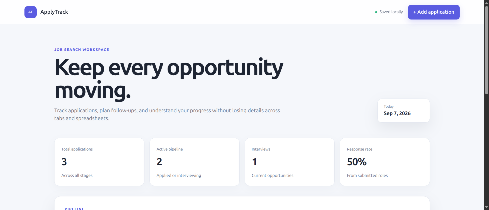

# ApplyTrack

ApplyTrack is a full-stack job application tracker for managing opportunities,
follow-ups, interviews, and offers in one focused workspace.

## Live Demo

[Open ApplyTrack](https://applytrack-lme1.onrender.com/)

The hosted demo uses Render's temporary filesystem, so application records may
reset when the free service restarts or is redeployed. Local installations keep
their data in `data/applications.json`.

## Features

- Create, edit, delete, search, filter, and sort applications
- Dashboard metrics and response-rate calculation
- Persistent JSON storage with atomic writes
- Server-side validation and safe URL handling
- Responsive, accessible interface
- Zero runtime dependencies
- Automated data-store tests

## Technology

- Node.js HTTP server
- REST API
- HTML, CSS, and vanilla JavaScript
- File-based persistence
- Node test runner

## Run Locally

Requires Node.js 20 or later. Run npm start and open
http://localhost:3000. For automatic server restarts, run npm run dev.

## Test

Run npm test.

## API

- GET /api/health
- GET /api/stats
- GET /api/applications
- POST /api/applications
- PATCH /api/applications/:id
- DELETE /api/applications/:id

List requests support q, status, and sort query parameters.

## Built By

Developed by [Sameer Waseem](https://github.com/chsameerwaseem) and presented by [TwinStack Studio](https://github.com/twinstack-studio).

For project inquiries: hello.twinstackstudio@gmail.com
